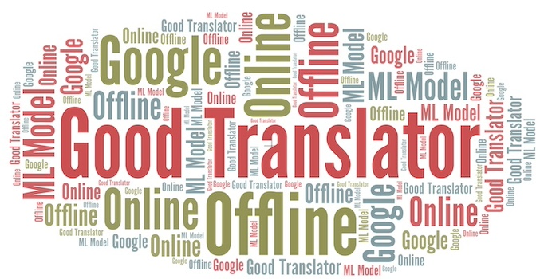
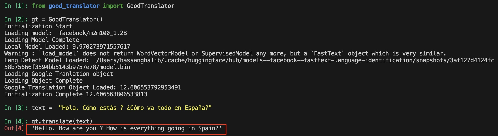
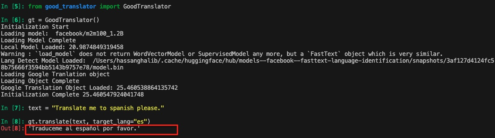
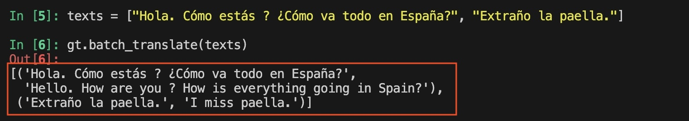

# Good Translator  (No API keys Needed)


<br>
A free translator (wrapper) that can do online and offline translations. This package uses the Google translator as its first option. In cases when the google translation doesn't work, It uses the offline translation model. The dual mode feature (online + offline) allows this package to always return translation result without failing. 

Machine with 16GB RAM can load and perform inferences with the local model.

## The following translation models/services are used

#### Google Translation
It relies on [deep-translator](https://github.com/prataffel/deep_translator/tree/master) for performing translations through Google.


#### Language Detection
It uses [facebook/fasttext-language-identification](https://huggingface.co/facebook/fasttext-language-identification) model for language detection. It can detect 217 languages. The model size is around 1.18GB. When the class object is initialized for the first time, this model is downloaded and stored in the cache dir "~/.cache/huggingface/hub"


#### Offline Translation Model
It uses [facebook/m2m100_1.2B](https://huggingface.co/facebook/m2m100_1.2B) model for performing offline translations. This model can directly translate between the 9,900 directions of 100 languages. It has 1.2B parameters. The model size is around 4.96GB. When the class object is initialized for the first time, this model is downloaded and stored in the cache dir "~/.cache/huggingface/hub"


**<font color='red'>Find the langauges supported by each model/service in '[docs/supported_langauges.md](docs/supported_langauges.md)' </font>**

## Usage

Install the package directly using:

```bash
python setup.py install
```

#### Translating a single string  (other language to english)
```python
from good_translator import GoodTranslator
gt = GoodTranslator()
text =  "Hola. Cómo estás ? ¿Cómo va todo en España?"
gt.translate(text)  # default value for param target_lang="en"
```




#### Translating a single string  (english to other language)
```python
from good_translator import GoodTranslator
gt = GoodTranslator()
text =  "Translate me to spanish please."
gt.translate(text, target_lang="es")
```



#### Translating a batch of strings 
The result will contains list of tuples with (original text, translated text)
```python
from good_translator import GoodTranslator
gt = GoodTranslator()
texts = ["Hola. Cómo estás ? ¿Cómo va todo en España?", "Extraño la paella."]
gt.batch_translate(texts)  # default value for param target_lang="en"
```




